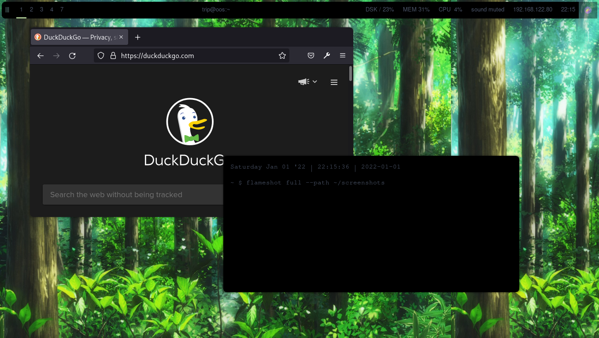
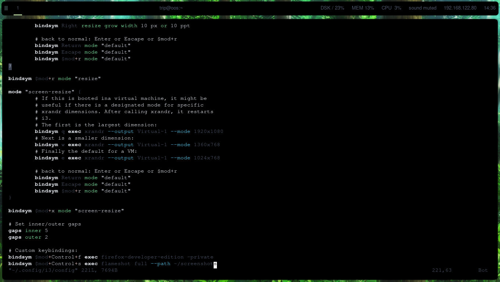

# Dotfiles 2021-12-30

These are my first dotfiles on GitHub. This config creates a clean nord-based theme.

## Installation

The packages that need to be installed are `i3-gaps` (wm), `kitty` (terminal emulator), `polybar` (bar), `picom-git` (compositor), `feh` (background-setter), `flameshot` (screenshotter), and `discord` (communications). (If I forgot anything, let me know.)

I do not know where the wallpaper came from. If you do, let me know so I can credit them. To install it, move it to /usr/share/backgrounds.

## Screenshots

